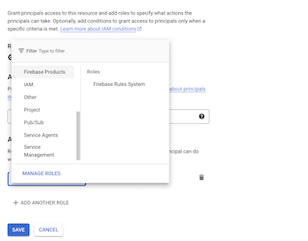
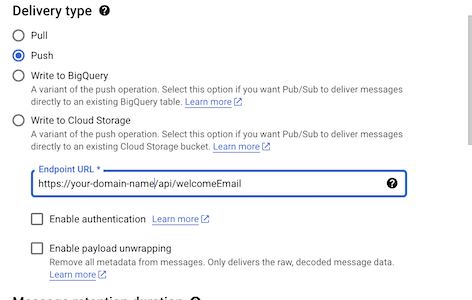
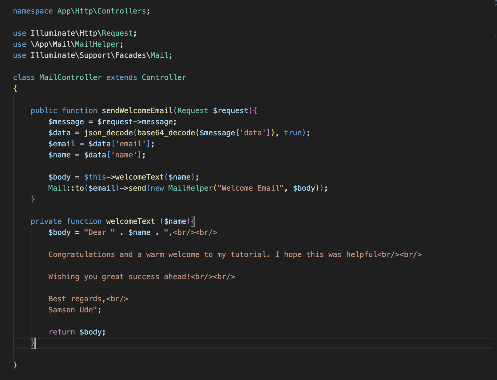
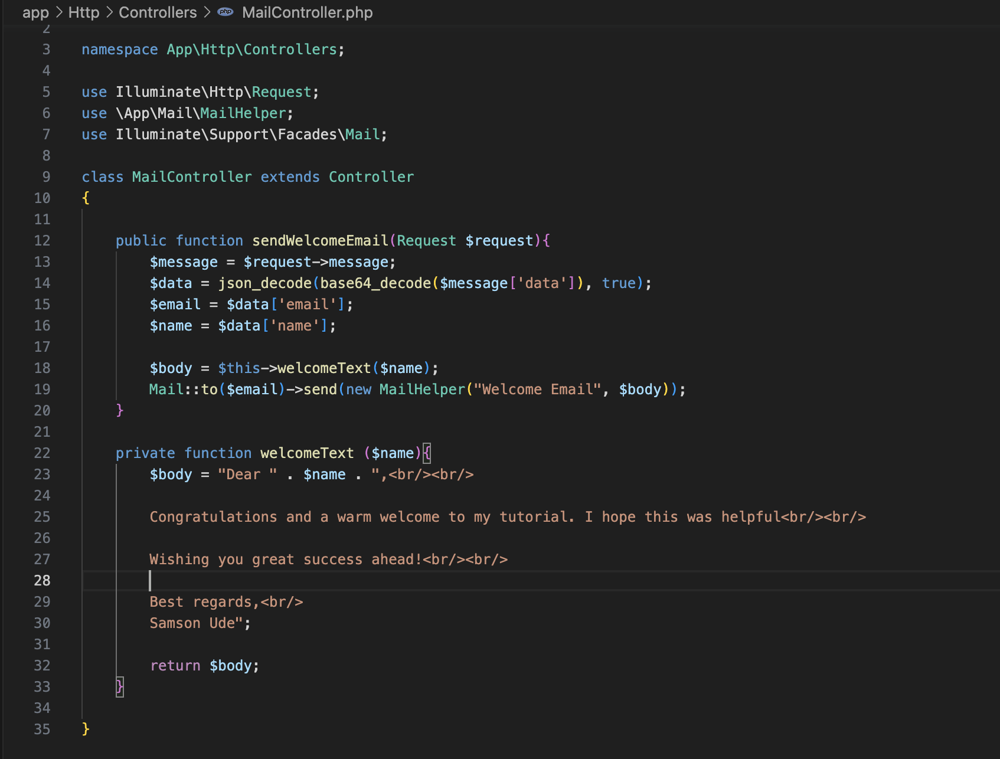
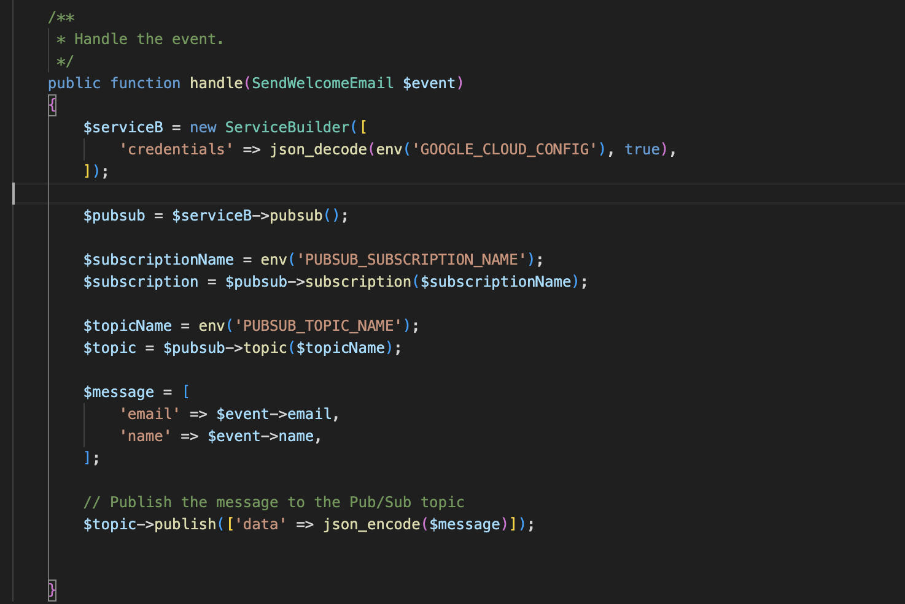
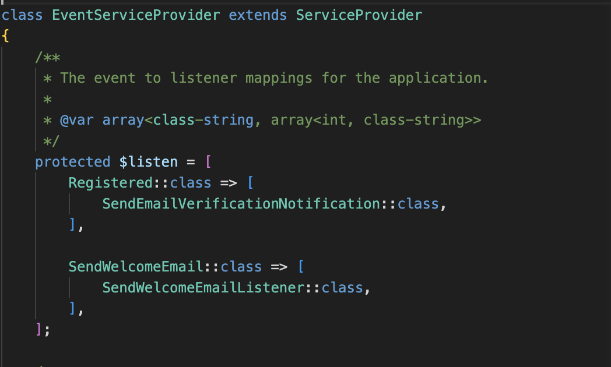
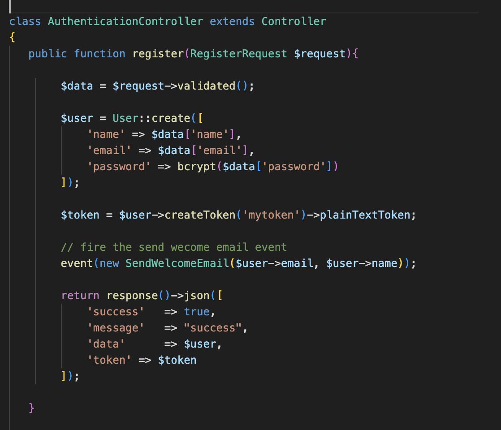

# Implementing Laravel Pub/Sub for Background Processing

**Subtitle:** A Step-by-Step Guide

## Introduction

In this tutorial, we'll explore how to implement a powerful background processing mechanism in Laravel using Google Cloud Pub/Sub. Pub/Sub, a publish-subscribe messaging service, serves as an invaluable tool when dealing with tasks that require asynchronous and scalable processing. We'll guide you through each step, illustrating how Laravel, coupled with Google Cloud Pub/Sub, can significantly enhance the performance and responsiveness of your applications.

### Why Google Cloud Pub/Sub?

**Google Cloud Pub/Sub is particularly advantageous** in scenarios where real-time communication, decoupling of services, and seamless scaling are paramount. It allows you to create a flexible and efficient messaging architecture, making it an ideal choice for implementing background tasks in Laravel.

### Limitations of Serverless Background Queues

While serverless platforms like Google Cloud Run offer a convenient and cost-effective way to run applications, they do come with some limitations. **Running background queues on serverless platforms might pose challenges** due to the ephemeral nature of serverless instances. Long-running tasks may face interruptions and might not guarantee the completion of background jobs. This is where Google Cloud Pub/Sub shines, as it offers a robust and reliable messaging infrastructure that ensures the delivery and processing of messages, even in serverless environments.

## Prerequisites

-   Basic understanding of Laravel and its components.
-   Google Cloud account with Pub/Sub API enabled.
-   Familiarity with Composer for package management.

## Step 1: Create a New Laravel Application using Laravel Sail

Laravel Sail is a lightweight command-line tool that provides a Docker-powered development environment for Laravel. It makes setting up your development environment a breeze. Let's create a new Laravel application using Sail:

Open your terminal and navigate to the directory where you want to create your Laravel project.

Run the following command to create a new Laravel application using Sail:

```bash
curl -s "https://laravel.build/laravel-pubsub" | bash
```

## Step 2: Configure Google Cloud Pub/Sub

-   Create a new project on Google Cloud Platform if you haven't already.
-   Enable the Pub/Sub API for your project.
-   Set up a service account and download the JSON key file.
-   Copy the downloaded JSON key file to your Laravel project's root directory.
-   Create a topic
-   Grant permission to the service account to use this topic
-   Create a subscription for that topic with a delivery type "Push" and specify the endpoint URL to be triggered.




## Step 3: Configure Laravel Environment

Edit the .env file in your project root and add the following lines to set up your Google Cloud Pub/Sub configuration:

```bash
GOOGLE_CLOUD_PROJECT_ID=your-google-product-id
```

```bash
PUBSUB_TOPIC_NAME=your-topic-name
```

```bash
PUBSUB_SUBSCRIPTION_NAME=your-subscription-name
```

## Step 4: Create the registration and send email endpoints

-   define the endpoints in api.php
-   Write the logic of the endpoint in the controller

```bash
Route::post('/register', 'AuthenticationController@register');
```

```bash
Route::post('/welcomeEmail', 'MailController@sendWelcomeEmail');
```




## Step 4: Create Event, Listener, and Service Provider

```bash
php artisan make:event SendWelcomeEmail
```

-   Create Listener: Generate a listener that sends an email when the user registration event is fired:

```bash
php artisan make:listener SendWelcomeEmailListener --event=SendWelcomeEmail
```

-   Edit the SendWelcomeEmailListener listener in app/Listeners/SendWelcomeEmailListener.php:



-   Map the event to the listener in /App/Providers/EventServiceProvider class



-   Edit the AuthenticationController (app/Http/Controllers/AuthenticationController.php) to include the event



## Step 5: Testing the Implementation

```bash
./vendor/bin/sail up
```

-   Test the user registration by making a POST request to /register with user data.
